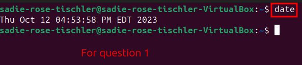
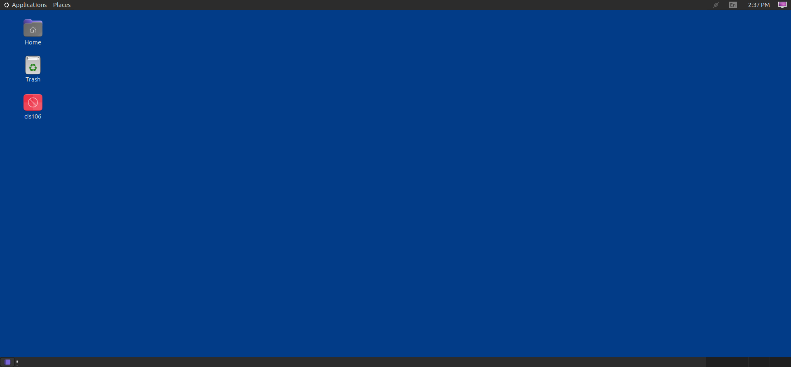

# Lab 3 Using Ubuntu Submission

## Question 1

## Question 2

## Question 3
| Program purpose     | Package Name | Version        |
| ------------------- | ------------ | -------------- |
| Play a tetris game  | Quadrapassel | 40.2           |
| Play a video file   | mpv          | 0.35.1         |
| Browse the internet | Firefox      | 118.0.2        |
| Read your email     | Thunderbird  | 115.3.1+build1 |
| Play music          | Audacious    | 4.2            |

## Question 4
| command | what it does                                                         |
| ------- | -------------------------------------------------------------------- |
| echo    | Repeats the string in parenthesis onto the next line in the terminal |
| fortune | Displays a random quote                                              |
| cowsay  | Displays ASCII art of a cow with a message                           |
| lolcat  | Makes text in the terminal rainbow colored                           |
| figlet  | Makes an ASCII text banner in the terminal                           |
| toilet  | Prints large colorful characters using smaller characters            |
| rig     | Generates a random name and address                                  |