# Week Report 4

## Practice from the presentation The Linux File System:

### Practice 1

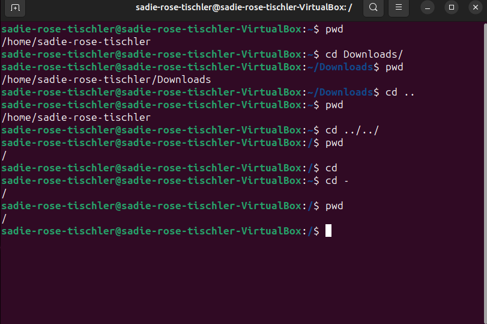 

### Practice 2

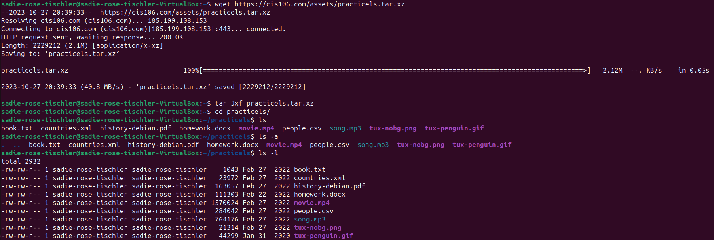 
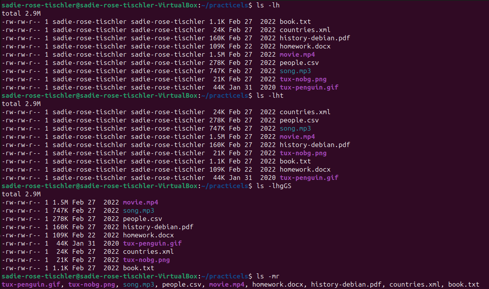 
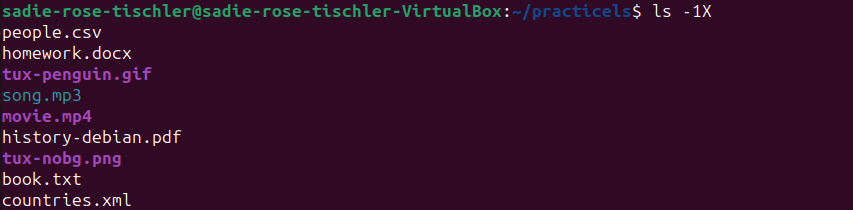 

### Practice 3

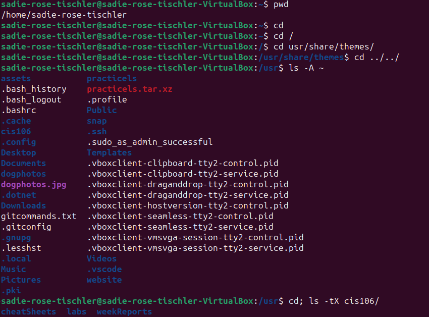 
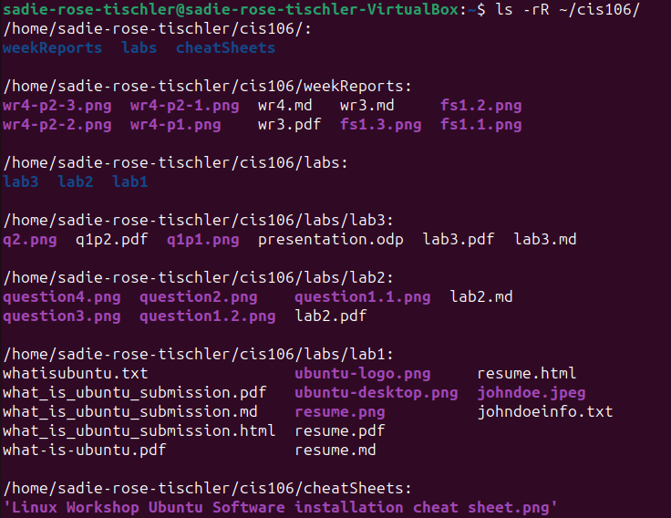 
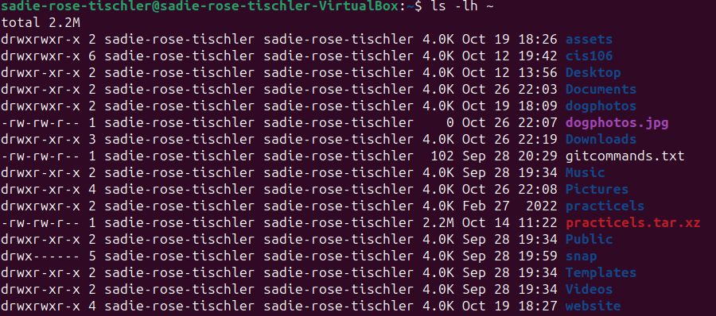 
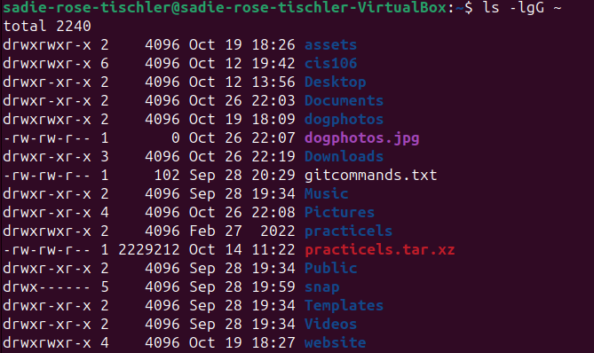 

## The Linux File System directories and their purpose:

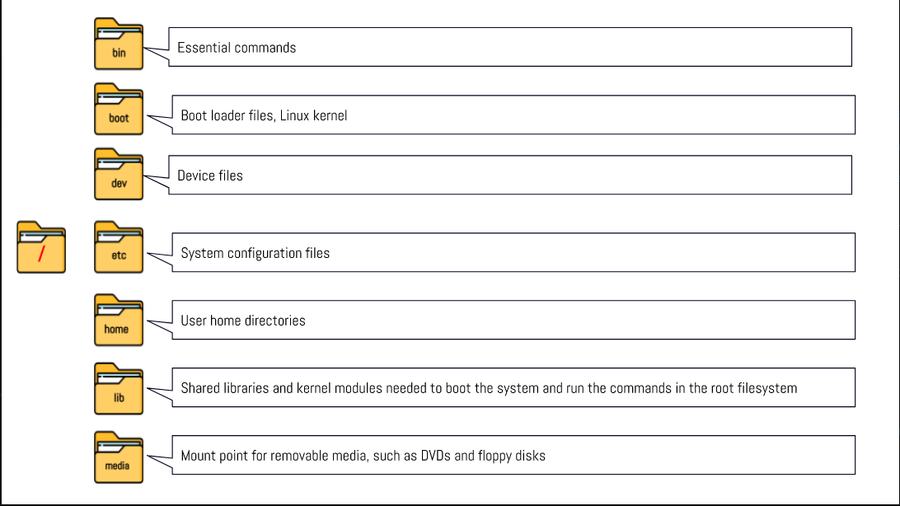 
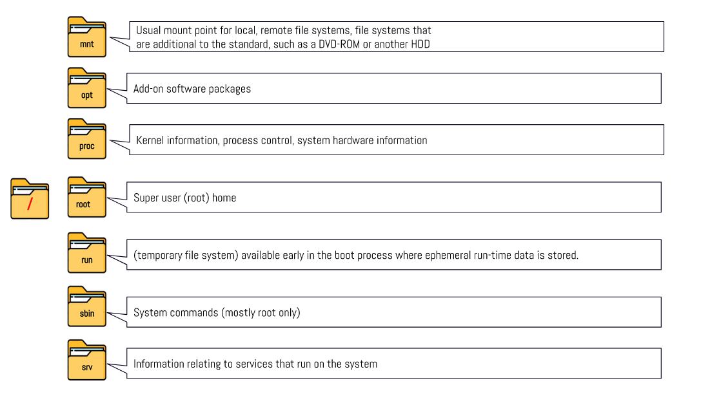 
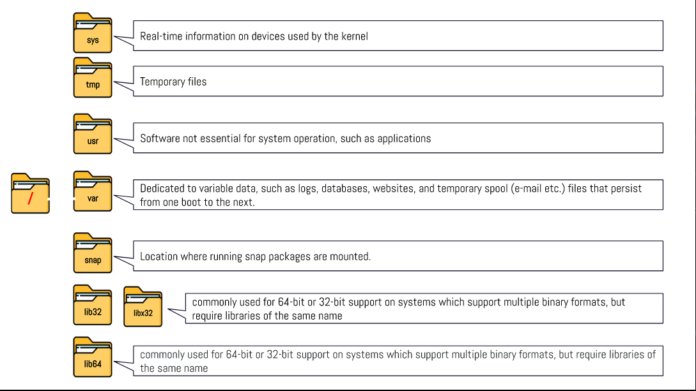 

## All the commands for navigating the filesystem:

| Command | What it does                               | Syntax | Example           |
| ------- | ------------------------------------------ | ------ | ----------------- |
| pwd     | Prints the current directory               | pwd    | `pwd`             |
| cd      | Changes the current directory              | cd     | `cd ~/Pictures/`  |
| ls      | Lists the files and folders in a directory | ls     | `ls ~/Downloads/` |

## Basic terminology:

* **File system:** The way files are stored and organized.

* **Current directory:** The directory that you are currently working in.

* **Parent directory:** The directory before your current working directory.

* **The difference between your home directory and the home directory:** Your home directory is the current user's home directory. The home directory is the home directory in root.

* **Pathname:** The location of a file in the filesystem.

* **Relative path:** The pathname starting from the directory inside your present one. Ex: If in home, pictures/rat.png

* **Absolute path:** The pathname starting with the root (/). Ex: /home/user/Pictures/rat.png
