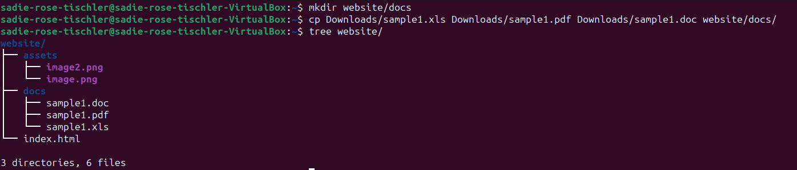

# Week Report 5

## Answers to Questions

* **What are Command Options?**
Command options change or enhance the behavior of a command.

* **What are Command Arguments?**
Command arguments are the items that a command acts on, such as a file or a directory.

* **Which command is used for creating directories? Provide at least 3 examples.**
The command is `mkdir`
* Example 1:
  * Creating a single directory: `mkdir rats`
* Example 2:
  * Creating multiple directories: `mkdir ~/Documents/icecream ~/Downloads/catphotos`
* Example 3:
  * Create a directory with a parent directory: `mkdir -p memes/clowns`

* **What does the touch command do? Provide at least 3 examples.**
The touch command creates files.
* Example 1:
  * Creating a single file: `touch apples.png`
* Example 2: 
  * Creating multiple files: `touch program.cpp notes.txt`
* Example 3:
  * Creating a file with spaces: `touch "numbers of friends.txt"`

* **How do you remove a file? Provide an example.**
The command to remove a file is `rm`
* Example:
  * `rm notes.txt`

* **How do you remove a directory and can you remove non-empty directories in Linux? Provide an example**
You can remove empty directories with the `rm` command. To remove non-empty directories, you must use `rm -r`
* Example:
  * `rm -r Pictures/wallpapers`

* **Explain the mv and cp command. Provide at least 2 examples of each**
The `mv` command moves and renames directories and files. The `cp` command copies files and directories from a source to a destination.
* Example 1:
  * Move files between directories: `mv Downloads/numbers.txt Documents/`
* Example 2:
  * Rename a file: `mv numbers.txt addresses.txt`
* Example 1:
  * Copying a file: `cp Downloads/clown.png Pictures/`
* Example 2:
  * Copy one directory to another: `cp Downloads/Clowns Pictures/`

## Practices

### Practice 1
 

### Practice 2
 

### Pratice 3
 

### Pratice 4
 