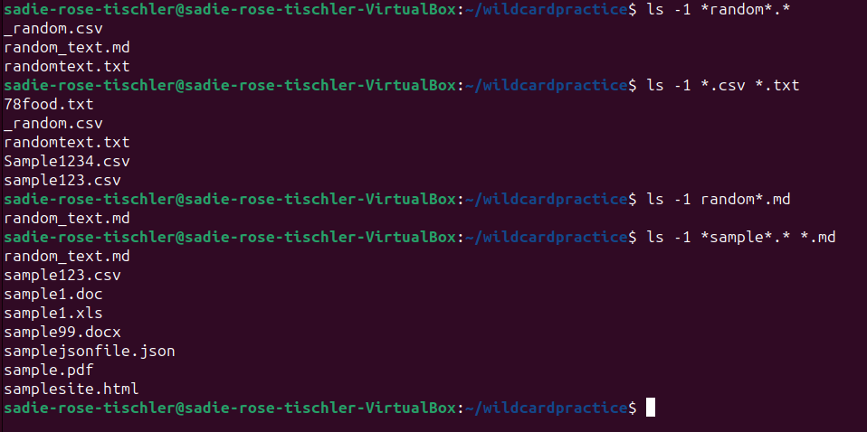
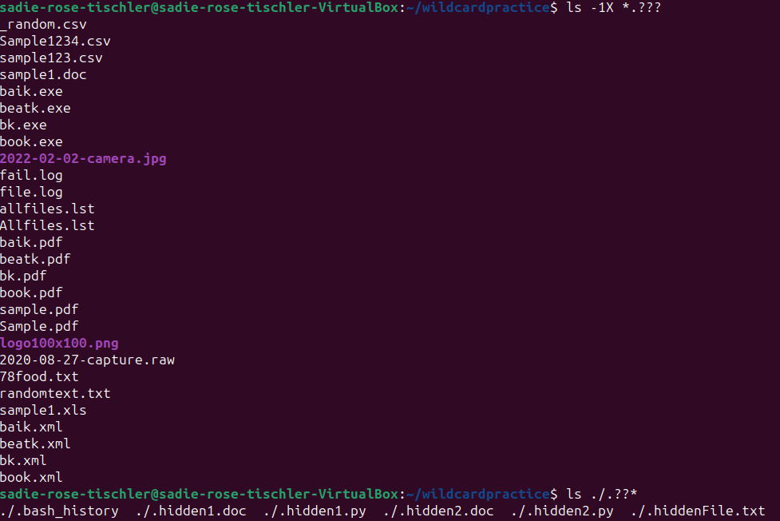
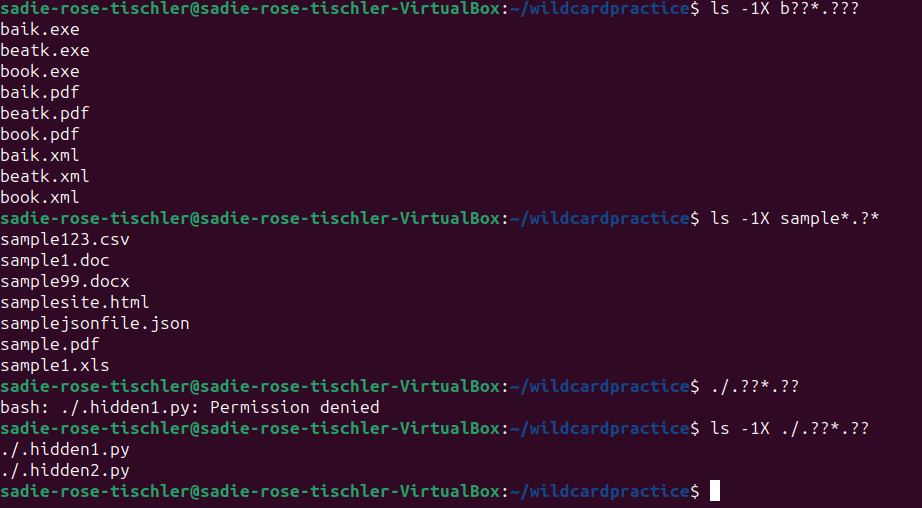
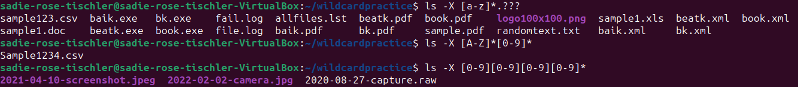
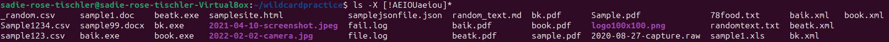
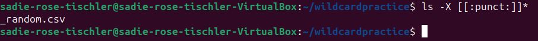

# Week Report 6

## Wildcards

### * Wildcard
The * wildcard matches any characters 0 or more times.
* Examples:
  * List all text files in a directory
    * `ls *.txt`
  * List all files that start with dog
    * `ls dog.*`
  * List all files that have any letters before the word apple
    * `ls *apple.*`

### ? Wildcard
The ? wildcard matches one character.
* Examples:
  * List all the files with a 2 character file extension
    * `ls *.??`
  * List all the files that start with c and have 3 characters
    * `ls c??.*`
  * Copy all png files that has a name of 3 characters
    * `cp ~/Downloads/???.png ~/Pictures/`

### [] Wildcard
The brackets wildcard matches a single character in the range. It uses an exclamation mark to reverse a match.
* Examples:
  * List all files that have any letters after c
    * `ls c[a-z]*`
  * List all doc files that do not have numbers in the name
    * `ls *[!0-9].doc`
  * List all png files whose name begins with h-o or start with f or n
    * `ls [h-ofn]*.png`

### Brace Expansion
Brace expansion {} is used to generate strings with a command
* Examples:
  * Create 5 png files at once
    * `touch image{1..5}.png`
  * Create multiple directories at once
    * `mkdir -p ~/Pictures/{dogs,cats}/{fluffy,big,small}/pics{1..3}`
  * Remove multiple files at once
    * `rm -r {image1.png,image2.png,image3.png}`

## Practices

### Practice 5
 

### Practice 6
 
 

### Practice 7
 
 
 
